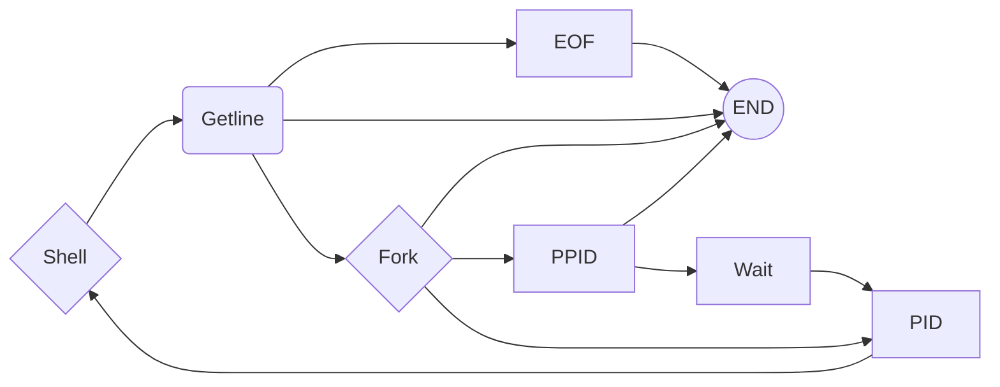

# 0x017. C - Simple Shell



by Blake Willis and Clayton Christian

# What's a Shell??

Simply put, the shell is a program that takes commands from the keyboard and gives them to the operating system to perform. In the old days, it was the only user interface available on a Unix-like system such as Linux. Nowadays, we have _graphical user interfaces (GUIs)_ in addition to _command line interfaces (CLIs)_ such as the shell.

# How to Use a Shell..

It's a program called a _terminal emulator_. This is a program that opens a window and lets you interact with the shell. There are a bunch of different terminal emulators we can use. Some Linux distributions install several. These might include `gnome-terminal`, `konsole`, `xterm`, `rxvt`, `kvt`, `nxterm`, and `eterm`.

Window managers usually have a way to launch a terminal from the menu. Look through the list of programs to see if anything looks like a terminal emulator. While there are a number of different terminal emulators, they all do the same thing. They give us access to a shell session. You will probably develop a preference for one, based on the different bells and whistles it provides.

## Syntax

```
command name [arguments] [pipe/redirection] [another arguments]

Example:
cat file_name | wc -l
```

## Learning Objectives

### General
> -   Who designed and implemented the original Unix operating system
>-   Who wrote the first version of the UNIX shell
>-   Who invented the B programming language (the direct predecessor to the C programming language)
>-   Who is Ken Thompson
>-   How does a shell work
>-   What is a pid and a ppid
>-   How to manipulate the environment of the current process
>-   What is the difference between a function and a system call
>-   How to create processes
>-   What are the three prototypes of  `main`
>-   How does the shell use the  `PATH`  to find the programs
>-   How to execute another program with the  `execve`  system call
>-   How to suspend the execution of a process until one of its children terminates
>-   What is  `EOF`  / “end-of-file”?
