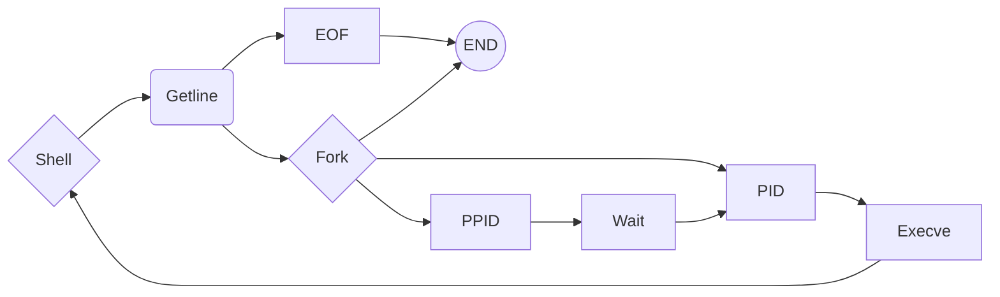

# 0x017. C - Simple Shell

# What's a Shell??

StackEdit stores your files in your browser, which means all your files are automatically saved locally and are accessible **offline!**

# How to Use a Shell..

The file explorer is accessible using the button in left corner of the navigation bar. You can create a new file by clicking the **New file** button in the file explorer. You can also create folders by clicking the **New folder** button.

## Syntax

All your files and folders are presented as a tree in the file explorer. You can switch from one to another by clicking a file in the tree.

## Learning Objectives

### General
>-   Who designed and implemented the original Unix operating system
>-   Who wrote the first version of the UNIX shell
>-   Who invented the B programming lang. (the direct predecessor to the C programming language)
>-   Who is Ken Thompson
>-   How does a shell work
>-   What is a pid and a ppid
>-   How to manipulate the environment of the current process
>-   What is the difference between a function and a system call
>-   How to create processes
>-   What are the three prototypes of  `main`
>-   How does the shell use the  `PATH`  to find the programs
>-   How to execute another program with the  `execve`  system call
>-   How to suspend the execution of a process until one of its children terminates
>-   What is  `EOF`  / “end-of-file”
